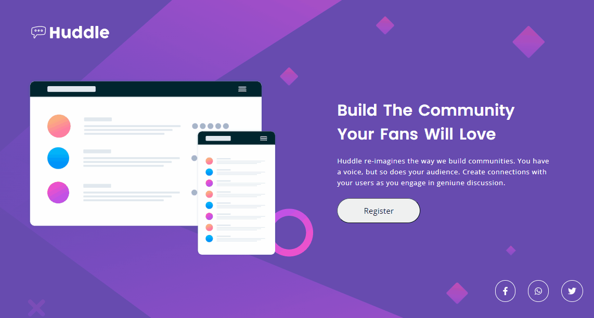
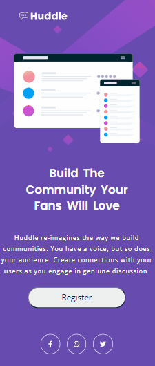

# Quest Html + Css Avançado

#### Projeto do desafio do curso Devquest, basedo no desafio do Front-end Mentor Huddle landing page.

# Versão Desktop:
[
    
]

# Versão Mobile:
[
    
]

# Desafio do projeto:

- Criar uma página html semântica 
- Estilizar e posicionar os elementos com o Css
- Deixar o projeto responsivo através do Css

## Aprendizado:
- Quando e onde colocar as class 
- Aperfeiçoar o uso do Display flex e grid 

# Linguagens utilizadas:

- Html 
- Css
